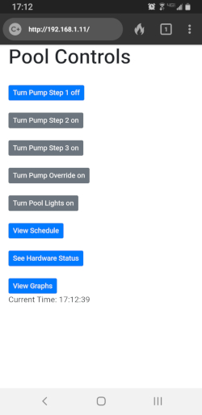

# PoolControls
Initialized 9/22/2019

Updated with working files 10/31/2019

NOTE: This is a working system here at my house.  I'm also always tweaking on it.  Don't be upset if you clone this and try to make it work and it doesn't.  Just be happy if it does work.  When I've had more time to dedicate to it, I will be able to fine-tune the docs and stuff here.

### A bit of History

The controls for your average backyard inground pool are pathetic.  I felt like I could do better with a Raspberry Pi, a relay board and some Python.  Here is what I have so far.

The front page of controls on my phone.
